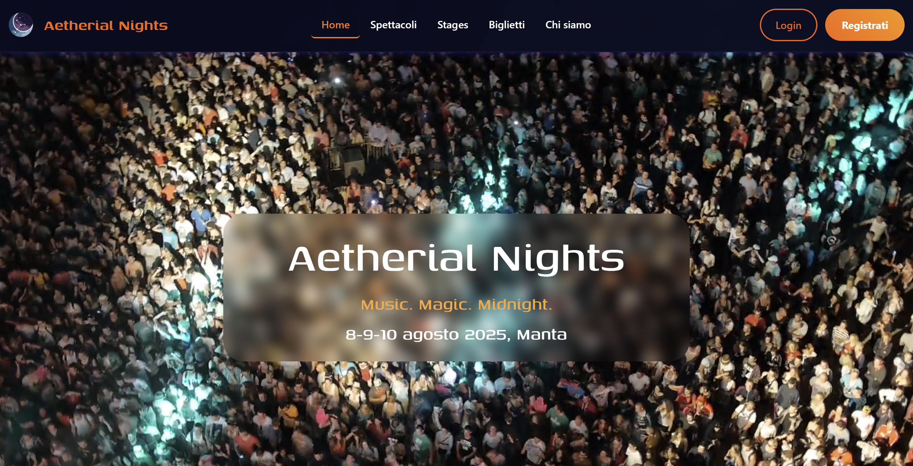

# Music Festival



## Description
A dynamic, full-stack web application designed for end-to-end music festival event scheduling and ticketing management, developed as the final project for the **Introduzione alle Applicazioni Web** course at **Politecnico di Torino**. Built with Python, Flask, and SQLite, the platform implements role-based access control (Organizers vs. Attendees), automated stage-conflict scheduling validation, transactional ticket purchase limits, and responsive desktop-first UI templates deployed live on PythonAnywhere.

---

## Live Demo & Credentials

* **Live URL:** [https://steudoc2.pythonanywhere.com/](https://steudoc2.pythonanywhere.com/)
* **Default Password for All Accounts:** `password`

### Pre-Registered Test Accounts

| Role | Email Accounts | Permissions & Capabilities |
| :--- | :--- | :--- |
| **Organizers** | `stefanotallone@email.com`<br>`marcotallone@email.com`<br>`osvaldomobrey@email.com`<br>`edmonddantes@email.com`<br>`martaduemila.ms@gmail.com` | Create/edit draft lineups, publish events, enforce stage exclusivity, inspect global daily ticket sale analytics. |
| **Attendees** | `lucianotallone@email.com`<br>`laurarinaudo@email.com`<br>`antonio@email.com`<br>`yanez@email.com`<br>`simple@email.com` | Browse published performances, filter by day/stage/genre, purchase festival passes (Single Day, 2-Day Pass, Full Pass). |

---

## Key Architectural & Functional Highlights

* **Role-Based Access Control (RBAC):** Distinct permission models managed via **Flask-Login** separating Unregistered Guests (read-only), Registered Attendees (ticketing client), and Event Organizers (back-office management).
* **Conflict-Free Lineup Scheduling:** Backend scheduling engine that guarantees a single performance per stage at any given timeframe, validating start time, duration, and artist uniqueness across festival stages.
* **Draft vs. Published Workflow:** State validation permitting organizers to edit line-up specifics (stage, time, details) only while marked as unlisted drafts; locking fields permanently once published to the public feed.
* **Business-Constrained Ticketing System:** 
  * Strict ticketing rules preventing multiple pass types per user.
  * Hard capacity limits capping festival attendance at **200 attendees per day**, dynamically locking checkout once daily capacity is reached.
* **Defensive Form Validation:** Dual-layer client-side HTML5 and server-side WTForms/Flask validation ensuring data integrity across forms.
* **Responsive Desktop-First Design:** Custom semantic HTML5/CSS3 styled layouts optimized for desktop inspection while adapting gracefully to mobile and tablet screens.

---

## Tech Stack & Tools

* **Backend:** Python 3, Flask, Flask-Login
* **Persistence & ORM:** SQLite3 relational database, parameterized SQL queries
* **Frontend:** Semantic HTML5, CSS3, Bootstrap (custom theme overrides), Jinja2 templates
* **Deployment & Hosting:** PythonAnywhere WSGI environment

## Getting started
Ensure Python 3 and pip are installed on your machine
```
### 1. Clone the repository
git clone [https://github.com/your-username/your-repo-name.git](https://github.com/your-username/your-repo-name.git)
cd your-repo-name

### 2. (Optional) Create and activate a virtual environment
python3 -m venv venv
source venv/bin/activate  # On Windows: venv\Scripts\activate

### 3. Install dependencies
pip install -r requirements.txt

### 4. Launch the application
flask run

### Or run in development mode with live reloading:
flask run --debug
```
